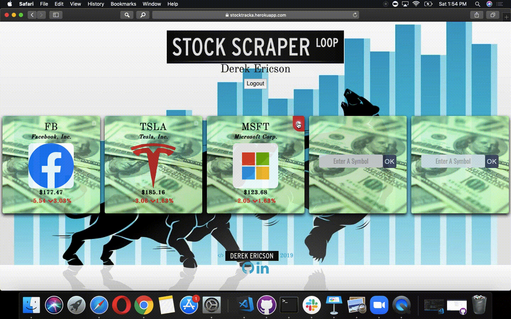

# Real-time Stock Scraper
Mongo-Express-React-Node Application

Node modules used:

-Passport

-Mongoose

-Axios

-CORS

-Passport-Google-OAuth

-Express-Session

-Moment

API:

-IEX Cloud (only temporary for now after free unlimited option was sunset on 06.01.19)

# How it works:

-Express back-end for user authentication

-React front-end (depoloyed separately)

-Cors module to helps avoid rejection between apps

-IEX Cloud API for stock data and logos

-Mongo to store user data (stored by Google ID)-> page will display your full name after logging in

Heroku App Link: https://stocktracka.herokuapp.com/

```
Login Page
```


```
Entering in a new stock by ticker symbol
```


```
Deleting a stock
```



```
Going to stock detail page, which has five-day price history and recent articles pulled from API
```


Future improvements to expect:

-Will switch API most likely when current does not have an unlimited plan and need that for the refreshes every few seconds

-Want ability to also search cryptocurrency data

-Want to turn into a game where each user is given a certain bank, which can use to simulate a purchase in real-time prices.  The portfolio value will be stored based on number of shares x current price in real-time.  I then want to have a rankings displayed to show how all users have done in comparison with the same starting bank ($10k for example).
